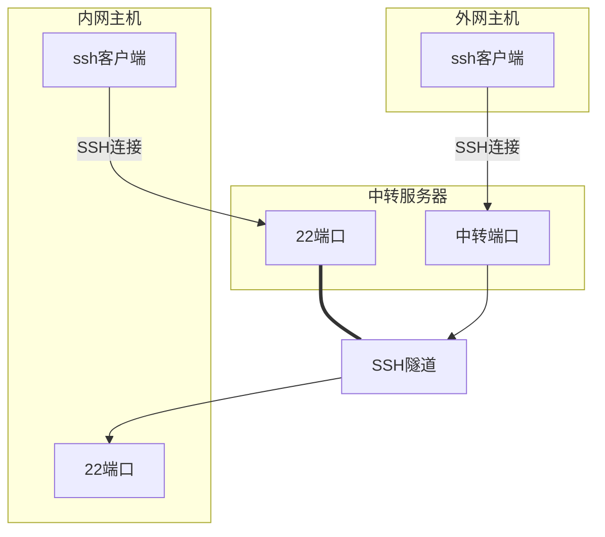

# 利用SSH反向代理登录内网主机

**解决问题：内网主机没有公网IP，无法从外网登录**



| [user_on_internal_host]   | root             |
| ------------------------- | ---------------- |
| [jump_server_user]        | root             |
| [jump_server_user_passwd] | Rf{6v)X6,WAgX*[E |
| [jump_server_ip]          | 141.164.56.112   |
| [remote_port]]            | 2222             |

## 1. 中转服务器设置

- 关闭对应端口的防火墙

  ```shell
  ufw allow [remote_port]
  ```

- 设置ssh配置文件

  ```shell
  vim /etc/ssh/sshd_config
  ```
  
  ```
  GatewayPorts yes
  ```

- 重启ssh服务

  ```
  systemctl restart ssh
  ```

## 2. 内网主机ssh连接中转服务器

```shell
ssh -f -N -T -R [remote_port]:localhost:22 [jump_server_user]@[jump_server_ip]
```

这个 SSH 命令用于在内网主机和中转服务器之间创建反向代理隧道。下面是命令参数的解释：

- `-f`：此选项告诉 SSH 在建立连接后将自身放入后台运行。即使你关闭终端，SSH 仍会继续运行。
- `-N`：这个选项告诉 SSH 不要执行远程命令。因为我们只需要创建一个端口转发，而不需要在远程主机上执行命令，所以使用 `-N`。
- `-T`：禁用伪终端分配。因为我们只关心端口转发，所以不需要分配一个伪终端。
- `-R [remote_port]:localhost:22`：这是 SSH 反向代理的关键选项。`-R` 表示反向代理，`[remote_port]` 是中转服务器上用于监听请求的端口，`localhost:22` 表示内网主机的 SSH 服务地址。将流量从中转服务器的 `[remote_port]` 转发到内网主机的端口 22（SSH 服务默认端口）。
- `[jump_server_user]@[jump_server_ip]`：中转服务器的用户名和 IP 地址或域名。

此命令将在内网主机和中转服务器之间建立一个 SSH 连接，并在连接中创建一个反向代理。外部客户端可以通过连接到中转服务器的 `[remote_port]` 来访问内网主机上的 SSH 服务。这种方法通常用于内网穿透，让外部客户端可以访问内网服务。

## 3. 外网客户端连接内网主机

```shell
ssh -p [remote_port] [user_on_internal_host]@[jump_server_ip]
```

## 4. 公钥登录（安全）

**中转服务器和内网主机都要设置**

- 客户端创建公钥（如果没有）(客户端)

  ```
  ssh-keygen
  ```

- 将公钥传到服务端主机的目标用户上

  - ssh-copy-id （客户端）

  ```
  ssh-copy-id -i ~/.ssh/id_rsa.pub [user]@[server_ip]
  ```

  - 手动复制 （服务端）

  ```
  mkdir -p ~/.ssh
  chmod 700 ~/.ssh
  touch ~/.ssh/authorized_keys
  chmod 600 ~/.ssh/authorized_keys
  vim ~/.ssh/authorized_keys
  ```

  将公钥内容粘贴到 `authorized_keys` 文件中并保存

- 修改ssh配置文件 （服务端）

  ```
  vim /etc/ssh/sshd_config
  ```

  ```
  PubkeyAuthentication yes # 启用公钥认证
  PasswordAuthentication no # 关闭密码认证，谨慎操作！
  ```

- 重启ssh服务 （服务端）

  ```
  systemctl restart ssh
  ```

## 5. 设置自动重连（稳定）

- 查看ssh隧道进程是否运行（中转服务器）

  ```shell
  lsof -i :[remote_port]
  ```
- 结束之前的进程（中转服务器）

  ```shell
  kill [pid_of_ssh_tunnel]
  ```
- autossh自动重连

	```shell
	autossh -M 0 -f -N -T -q -o "ServerAliveInterval 60" -o "ServerAliveCountMax 3" -R [remote_port]:localhost:22 [jump_server_user]@[jump_server_ip]
	```

autossh命令的参数如下：

- `-M 0`：这个选项用于设置控制连接的监视端口。`0` 表示不启用控制连接。在这种配置下，`autossh` 仅依赖于 SSH 本身的 ServerAlive 机制（见后文）来检测连接状态。
- `-f`：此选项告诉 `autossh` 在建立连接后将自身放入后台运行。即使你关闭终端，`autossh` 仍会继续运行。
- `-N`：这个选项告诉 SSH 不要执行远程命令。因为我们只需要创建一个端口转发，而不需要在远程主机上执行命令，所以使用 `-N`。
- `-T`：禁用伪终端分配。因为我们只关心端口转发，所以不需要分配一个伪终端。
- `-q`：这个选项告诉 `autossh` 以安静模式运行。在这种模式下，`autossh` 不会输出任何信息，除非发生错误。
- `-o "ServerAliveInterval 60"`：这个选项设置了 SSH 客户端向服务器发送空闲数据包的频率，以保持连接活跃。在这里，我们设置了 60 秒发送一次。如果在指定时间内没有其他数据包通过连接，客户端会自动发送一个数据包。
- `-o "ServerAliveCountMax 3"`：这个选项设置了在断开连接前，允许连续丢失的空闲数据包的最大数量。在这里，我们设置了 3 次。如果连续 3 次空闲数据包没有收到服务器的响应，SSH 客户端将认为连接已断开，并自动重连。
- `-R [remote_port]:localhost:22`：这是 SSH 反向代理的关键选项。`-R` 表示反向代理，`[remote_port]` 是中转服务器上用于监听请求的端口，`localhost:22` 表示内网主机的 SSH 服务地址。将流量从中转服务器的 `[remote_port]` 转发到内网主机的端口 22（SSH 服务默认端口）。
- `[jump_server_user]@[jump_server_ip]`：中转服务器的用户名和 IP 地址或域名。

